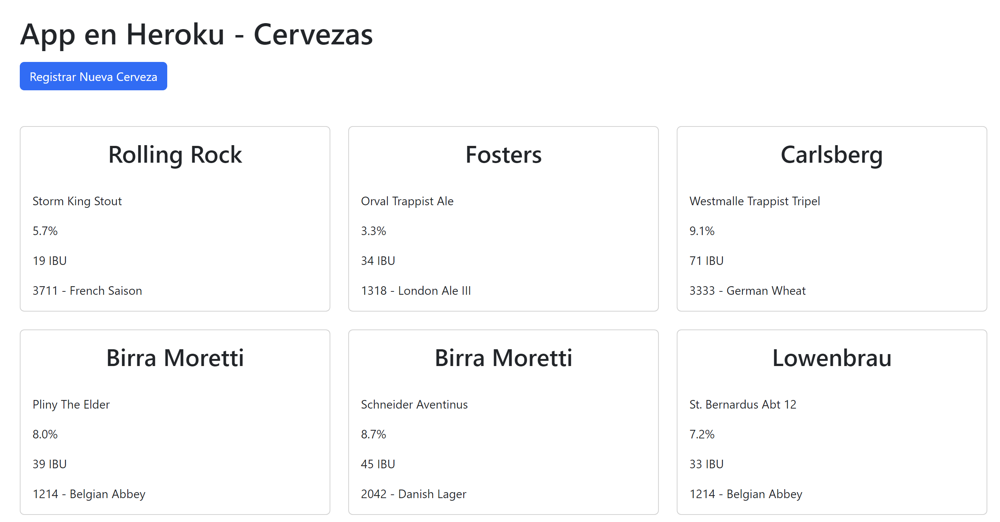

# Rails - Faker App

Ejemplo de uso de la gema Faker en una aplicación Rails, que permite generar datos de prueba para la base de datos. Asimismo, se utiliza la gema Annotate para agregar comentarios en los modelos con información de las columnas de la tabla de la base de datos.

## Gem Faker

Instalar la gema Faker,

```bash
gem install faker
```

Agregar al archivo Gemfile,

```ruby
group :development do
  gem 'faker'
end
```

Luego hacer un bundle,

```bash
bundle
```

La gema Faker se utiliza para generar datos de prueba. Por ejemplo, para generar datos de cervezas en este caso, se puede utilizar el siguiente código en el archivo seeds.rb,

```ruby
puts "Creating 20 beers..."

20.times do |_i|
  Beer.create(brand: Faker::Beer.brand, 
              name: Faker::Beer.name,
              alcoholic_grade: Faker::Beer.alcohol,
              ibu: Faker::Beer.ibu,  
              yeast_type: Faker::Beer.yeast
            )
end

```

Luego ejecutar el comando,

```bash
rails db:seed
```

Para generar los datos simulados en la base de datos.

Para ver los datos generados, se puede utilizar el comando,

```bash
rails c
```

Para abrir la consola de Rails y luego,

```ruby
Beer.all
```

Para ver los datos de la tabla de cervezas.

## Gem Annotate

Annotate es una gema que agrega comentarios en los modelos, controladores, etc. con información de las columnas de la tabla de la base de datos. Facilita no tener que estar abriendo el archivo de migración para ver las columnas de la tabla.

Uso,

```bash
gem install annotate
```

Agregar al archivo Gemfile,

```ruby
group :development do
  gem 'annotate'
end
```

Luego hacer un bundle,

```bash
bundle
```

Luego utilizar el comando,

```bash
annotate --models
```

Para que se agreguen los comentarios en los modelos. Por ejemplo,

```ruby
# == Schema Information
#
# Table name: beers
#
#  id              :bigint           not null, primary key
#  brand           :string
#  name            :string
#  alcoholic_grade :string
#  created_at      :datetime         not null
#  updated_at      :datetime         not null
#  ibu             :string
#  yeast_type      :string
#
class Beer < ApplicationRecord
end
```

## Conectando con Heroku

Para conectar con heroku iniciamos sesión,

```bash
heroku login
```

Luego creamos la aplicación en Heroku,

```bash
heroku create
```

Luego hacemos un push a Heroku,

```bash
git push heroku main
```

Es importante que la base de datos esté creada en Heroku (Para esto se debe añadir la extensión Heroku-Postgres a la app). Para ello, utilizamos el comando en la consola de heroku,

```bash
rails db:migrate
```

Para crear la base de datos en Heroku/Producción.

## Agregamos vista index y new

Agregamos la vista index para mostrar los datos de la tabla de cervezas. Para ello, creamos el archivo index.html.erb en la carpeta app/views/beers

Agregamos la vista new para crear un nuevo registro en la tabla de cervezas. Para ello, creamos el archivo new.html.erb en la carpeta app/views/beers

Ejemplo de despliegue en vista index,

